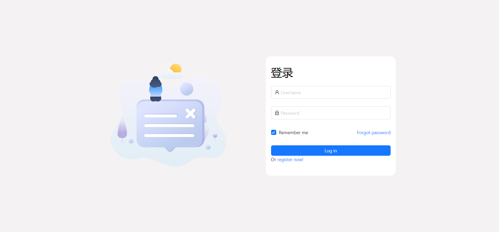

# react-antd demo项目

> react18 antd ts5+ mobx 模板

## 效果展示




## 依赖包版本

```json
{
  "antd": "^5.7.3",
  "react": "^18.2.0",
  "typescript": "^5.1.6",
  "react-router-dom": "^6.14.2"
  ... // 具体查看package.json
}
```

## node、npm版本

```json
{
  "node": "18.17.0", // >=18.0.0
  "npm": "9.6.8"
}
```

## 依赖链接

[react-router-dom_v6](https://reactrouter.com/)
[mobx_v6](https://zh.mobx.js.org/)


## mobx 使用案例

`@/src/store/moduls/authStore.ts`

```ts

import { makeAutoObservable } from 'mobx'
import { authApi } from '@/api/index'
import { makePersistable } from 'mobx-persist-store'

type Token = string | undefined | null

class AuthStore { 
    
    token: Token = undefined
    constructor() {
        makeAutoObservable(this)
        makePersistable(this, {
            name: 'AuthStore', // 存储到localStorage当中的key值是什么，此处为字符串string；
            properties: ['token'], // 需要持久化的数据是什么，此数据需要为上面声明了的变量，并且传值方式为[string]
            storage: window.localStorage, // 你的数据需要用那种方式存储，常见的就是localStorage
        })
    }

    get getToken(): Token {
        //  if (!this.token) {
        //     this.token = local.get('token')
        //  }
         return this.token
    }

    setToken(val:string):void {
        this.token = val
        // local.set('token',val)
        // setLocalToken(val)
    }


    /* 登录 */
     async login(data:object) {
         const result = await authApi.login(data)         
         if (!result) return false
         
        return result.data
    }
}

const useAuthStore = new AuthStore()

export default useAuthStore
```

`@/src/store/index.ts`

```ts
import React from 'react'
import { makeAutoObservable } from 'mobx'
import { makePersistable } from 'mobx-persist-store'
import useAuthStore from './modules/authStore'

 class RootStore {
     
     useAuthStore = useAuthStore
    
    constructor() {
        makeAutoObservable (this)        
    }

    
}

const rootStore = new RootStore()
// 这里可以使用React context 完成统一方法的封装需求
const context = React.createContext(rootStore)
// 封装useStore方法，业务组件调用useStore方法便就可以直接获取rootStore
const useStore = () => React.useContext(context)

export default useStore
```


`@/views/login/index.tsx`

```tsx
import { observer } from 'mobx-react-lite'
import useStore from '@/store'

function Login() {
  const { useAuthStore } = useStore()

  return (<div>{useAuthStore.getToken}</div>)

}

export default observer(Login)

```

### 成功展示


